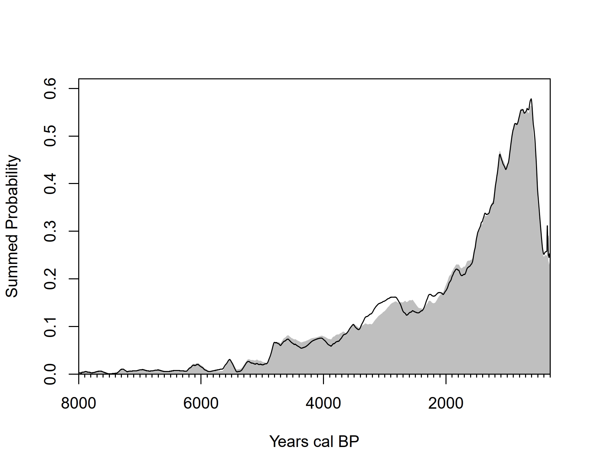

# caribbean-14C
## A compilation of 2147 anthropogenic radiocarbon (<sup>14</sup>C) dates for the Caribbean region from 504 sites across 57 islands. 

The information in this repository is largely adapted from the paper "Reevaluating human colonization of the Caribbean using chronometric hygiene and Bayesian modeling" by Napolitano et al. in _Science Advances_ (https://doi.org/10.1126/sciadv.aar7806). It also includes a number of newer radiocarbon dates that have since been published. The main file is `caribbean-14C.csv`.

Dates are mostly grouped and georeferenced by **island centroids**, that is, the geographical centre of the physical land mass the dated material originated from. The only exception are dates from the island of Hispaniola, which are split between Haiti and the Dominican Republic. In rare cases where an island's centroid lies in the sea (e.g. Crooked Island, Bahamas), it has been manually shifted to the nearest onshore location. 

</img>

Figure 1: Number of sites by island

## Metadata and usage information

Data are stored in a comma-separated value spreadsheet (.csv) file.

<ul>
  <li><b>UniqID:</b> Unique site identification number for ordering and indexing purposes.</li>
  <li><b>Island:</b> The island the date originates from.</li>
  <li><b>Country.Territory:</b> The country or territory the date originates from.</li>
  <li><b>Region:</b> Broad-scale region.</li>
  <li><b>Sub-region:</b> Sub-region, if applicable.</li>
  <li><b>Lon:</b> Longitude, in decimal degrees.</li>
  <li><b>Lat:</b> Latitude, in decimal degrees.</li>
  <li><b>SiteName:</b> Name of the site.</li>
  <li><b>Material:</b> The material dated.</li>
  <li><b>Type:</b> The type of sample dated.</li>
  <li><b>Provenience:</b> Stratigraphic provenience of sample, if available.</li>
  <li><b>LabNo:</b> Laboratory code of the radiocarbon date.</li>
  <li><b>Age:</b> Age of the sample in <sup>14</sup>C years before present.</li>
  <li><b>Error:</b> Measurement error.</li>
  <li><b>d13C:</b> Δ<sup>13</sup>C of the sample, if available.</li>
  <li><b>Reference:</b> Bibliographic reference for the sample.</li>
  <li><b>calCurves:</b> Appropriate calibration curve for the sample, for use in <i>rcarbon</i> or other calibration packages.</li>
</ul>

Outstanding issues with the data include:

1. The dates are not associated to cultural data as in, for example, [rxpand](https://github.com/jgregoriods/rxpand)
2. Local marine reservoir corrections are not included by default.

Oceanic circulation and upwelling in the Caribbean is complex (DiNapoli et al. 2021). An initial stopgap solution to the problem of accounting for the 525 determinations (~24%) made on marine material is to use the closest marine reservoir correction. ΔR and ΔR errors were obtained from [calib.org](http://calib.org/marine/) and spatially joined to the radiocarbon dates. Where multiple offset and error values were available, their average was used. 

This information is included in `caribbean_14C_delta.csv`, a derivative of the main file. As radiocarbon dates are only georeferenced to island centroids and offset values are averaged where multiple values are available, this is data provided at the risk of the end-user. It is not intended as a complete solution. Nonetheless, across the scope of the entire dataset, differences are likely minor. 

</img>

Figure 2: Comparison of reservoir-corrected summed probability distribution of calibrated radiocarbon dates (solid grey) and without correction (black line).

Where a mixed calibration curve may be desirable, for example on human bone with a known or estimated contribution of marine resources to diet (Hanna et al. 2021), _rcarbon_ provides a native function `mixCurves()` to easily produce a custom calibration curve:

```
library(rcarbon)
humanmix <- mixCurves(calCurve1 = "intcal20", calCurve2 = "marine20", p = 0.5)
```

## References

Calib.org [Internet]. 14Chrono Marine20 Reservoir Database. 2021. Last accessed: 2021-05-19. Available: http://calib.org/marine/.

Hanna JA, Pateman MP, Bloch L, Keegan WF. Human–environment interactions in a Bahamian dune landscape: A geoarchaeological study of a new Lucayan burial site. _Geoarchaeology_. **2021** https://doi.org/10.1002/gea.21866

Napolitano MF, DiNapoli RJ, Stone JH, Levin MJ, Jew NP, Lane BG, O’Connor JT, Fitzpatrick SM. Reevaluating human colonization of the Caribbean using chronometric hygiene and Bayesian modeling. _Science Advances_. **2019** 5: eaar7806. https://doi.org/10.1126/sciadv.aar7806

DiNapoli RJ, Fitzpatrick SM, Napolitano MF, Rick TC, Stone JH, Jew NP. Marine reservoir corrections for the Caribbean demonstrate high intra-and inter-island variability in local reservoir offsets. _Quaternary Geochronology._ **2021** 61: 101126. https://doi.org/10.1016/j.quageo.2020.101126.
