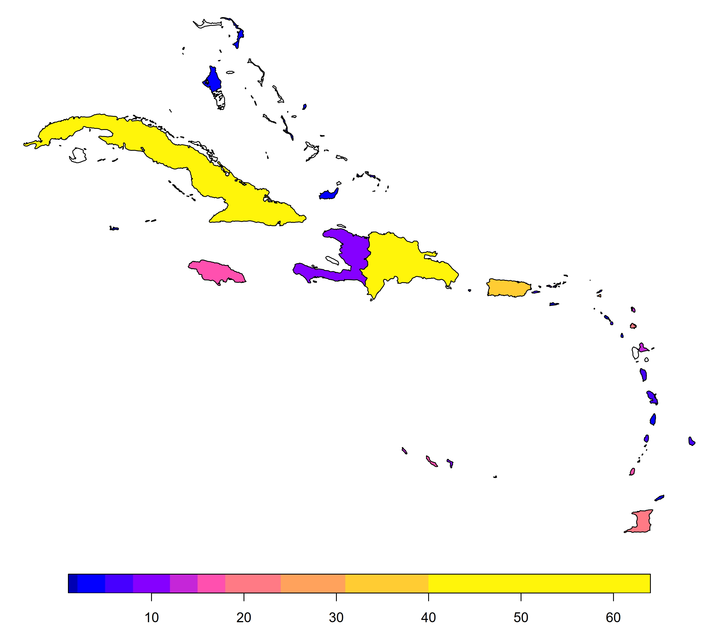

# caribbean-14C
## A compilation of 2134 anthropogenic radiocarbon (14C) dates for the Caribbean region from 503 sites across 57 islands. 

The information in this repository is largely adapted from the paper "Reevaluating human colonization of the Caribbean using chronometric hygiene and Bayesian modeling" by Napolitano et al. in _Science Advances_ (https://doi.org/10.1126/sciadv.aar7806). It also includes a number of newer radiocarbon dates that have since been published. 

Dates are mostly grouped and georeferenced by **island centroids**, that is, the geographical centre of the physical land mass the dated material originated from. The only exception are dates from the island of Hispaniola, which are split between Haiti and the Dominican Republic. In rare cases where an island's centroid lies in the sea (e.g. Crooked Island, Bahamas), it has been manually shifted to the nearest onshore location. 

</img>

Data are stored in a comma-separated value spreadsheet (.csv) file.

<ul>
  <li><b>UniqID:</b> Unique site identification number for ordering and indexing purposes.</li>
  <li><b>Island:</b> The island the date originates from.</li>
  <li><b>Country.Territory:</b> The country or territory the date originates from.</li>
  <li><b>Region:</b> Broad-scale region.</li>
  <li><b>Sub-region:</b> Sub-region, if applicable.</li>
  <li><b>Lon:</b> Longitude, in decimal degrees.</li>
  <li><b>Lat:</b> Latitude, in decimal degrees.</li>
  <li><b>SiteName:</b> Name of the site.</li>
  <li><b>Material:</b> The material dated.</li>
  <li><b>Type:</b> The type of sample dated.</li>
  <li><b>Provenience:</b> Stratigraphic provenience of sample, if available.</li>
  <li><b>LabNo:</b> Laboratory code of the radiocarbon date.</li>
  <li><b>Age:</b> Age of the sample in 14C years before present.</li>
  <li><b>Error:</b> Measurement error.</li>
  <li><b>d13C:</b> Δ13C of the sample, if available.</li>
  <li><b>Reference:</b> Bibliographic reference for the sample.</li>
  <li><b>calCurves:</b> Appropriate calibration curve for the sample, for use in _rcarbon_ or other calibration packages.</li>
</ul>
